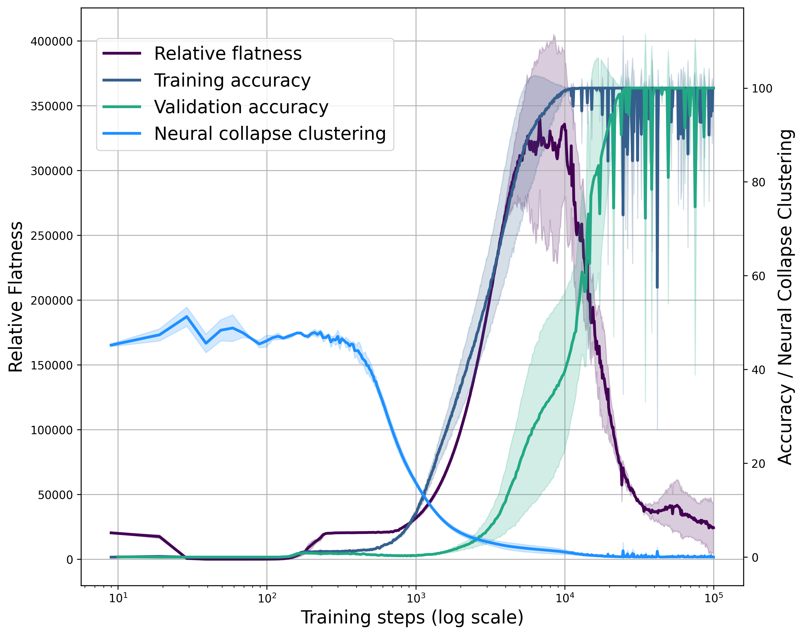

## Flatness is Necessary, Neural Collapse is Not: Rethinking Generalization via Grokking

[NeurIPS 2025] This repository contains the code for our paper [Flatness is Necessary, Neural Collapse is Not: Rethinking Generalization via Grokking](https://arxiv.org/abs/2509.17738).

## Overview

We investigate the roles of **Neural Collapse (NC)** and **Relative Flatness** in deep learning generalization. Using the grokking phenomenon as a conceptual testbed, we analyze how these signals emerge during the transition from memorization to generalization. We further validate our findings across standard deep learning architectures. We show that:

1. **Neural Collapse** is **_not_** necessary for generalization.
2. **Relative Flatness** is potentially necessary for generalization.
3. **Neural Collapse** provably **leads to Relative Flatness** under classical assumptions.



## Directory Overview

- **grokking_nc_rf/**: scripts and code for plotting Relative Flatness and Neural Collapse clustering using the grokking testbed (Figure 1).

- **nc_experiments/**: scripts and code for Neural Collapse clustering experiments (Figure 2).

- **rf_bert/**: scripts and code for Relative Flatness experiments on the BERT architecture (Figures 16 & 17).

- **rf_gpt2/**: scripts and code for Relative Flatness experiments on the GPT-2 architecture (Figures 18 & 19).

- **rf_resnet18/**: scripts and code for Relative Flatness experiments on ResNet-18 (Figure 4).

- **rf_vit/**: scripts and code for Relative Flatness experiments on the ViT architecture (Figure 4).

## Getting Started

1. Clone the repository:
```bash
git clone https://github.com/TrustworthyMachineLearning-Lab/grokking_flatness.git
```

2. Install dependencies:
```bash
pip install -r requirements.txt
```

3. Choose a task you would like to reproduce. For example, to run the Relative Flatness experiment on ResNet-18:
```bash
cd rf_resnet18
```

4. Run the shell script under the directory:
```bash
sh run_script.sh
```
Each directory contains a `run_script.sh` file where you can adjust the hyperparameters. To plot the Relative Flatness results, please use `relative_flatness_plot_results.ipynb`.

## Contributing

We welcome contributions! Please feel free to submit issues, feature requests, or pull requests.


## Citation

If you find our work useful, please cite us:

```bibtex
@inproceedings{han2025flatness,
    title={Flatness is Necessary, Neural Collapse is Not: Rethinking Generalization via Grokking},
    author={Ting Han and Linara Adilova and Henning Petzka and Jens Kleesiek and Michael Kamp},
    booktitle={The Thirty-ninth Annual Conference on Neural Information Processing Systems},
    year={2025}
}
```